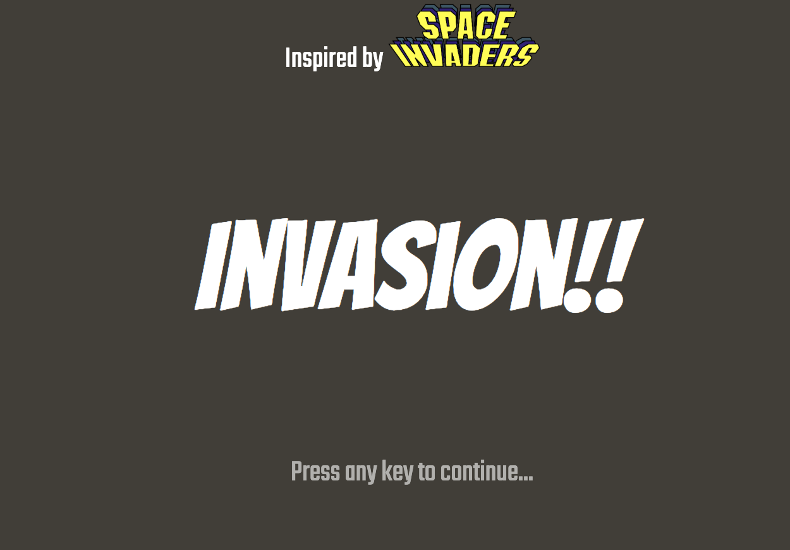
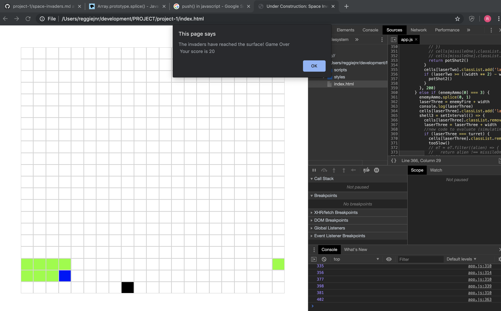

# Project-1-Invasion!

### Overview

As a component of the Software Engineering Immersive program we were tasked with developing a game to demonstrate our work with the technologies we were working with day-to-day.

The project was a week in length and we had the choice of a number of briefs that gave an overview of the requirements needed to result in a minimal viable product.

This project was constructed with HTML, CSS and pure Javascript. 

### Brief

I took on the Space Invaders brief as a result of the familiarity with the rules and it's classic status.

The objective of the project was to showcase our practical application of concepts in HTML, CSS and Javascript. As such we were unable to use technologies such as HTML canvas.

This brief had two main objectives for MVP:

* The player should be able to clear at least one wave of aliens
* The player's score should be displayed at the end of the game

### The Game

My Space Invaders project is titled 'Invasion!' and is constructed in a pseudo parody style of media such as 'Aeroplane!'.

The objective of the game is to clear the wave of alien spacecraft attempting to 'invade'. 



The player controls a spacecraft that is able to move from side to side along the base of the grid.

The player spacecraft is also able to fire a laser canon at the alien 'swarm' in an attempt to stop the invasion. 

The alien spacecrafts gradually move from side to side. Once they reach either side of the grid, the entire 'swarm' moves down a row.

The player gets 10 points through destroying each alien spacecraft with their laser canon.

The alien spacecraft continually fire, with varying frequency and from random ships, at the player. The player-controlled spacecraft can only get hit a maximum of 3 times (3 lives or spacecraft) before the game is over. The player is directed to a Game Over screen and their score is displayed.

If the player manages to clear the wave of alien spacecrafts, then the game is over with a success message and the player's score.

If the aliens manage to reach the bottom row of the grid then a game over message is displayed with an invasion message and the player's score.

### Build Process

We had recently gone through a range of Javascript applications and I was excited to build my own take on gird-style application with Javascript and the DOM.

To routinely check my work and hold my experiements I placed the game initialisation action behind an event listener. The thinking was that this would ultimately be converted to the welcome page.

My inital research on the game rules informed a decision to make the final enemy wave, 11 enemies long and 5 squares on either side to get an ideal range of motion. This resulted in a 21 x 21 grid created through pushing divs into the document.

The thinking for size was as follows:

	if we start our wave 5 lines down,
	21 squares - 5 lines = 16 rows
	16 rows- 5 enemy lines = 11 space rows
	
	then account for the player(1)
	11-1 = 10
	
	The wave will move through 10 oscillations.


As I got to grips with seeing results based logic, I decided to reduce the game to basic steps. My functions were designed to work and satisfy one step at a time. 

For example, the player div was designed to obey the rules of the grid. As the grid was essentially a 2D array, if this logic was not in place, the block would be able to move out of its row once a side was reached, or break the code when a div was reached that didnt exist.

```
document.onkeydown = function (e) {
      if (noLuck === 0 && gameOver === false) {
        switch (e.keyCode) {
          case (37):
          case (65): {
            if (turret === ((width ** 2) - width)) {
              return
            }
            cells[turret].classList.remove('turret')
            turret = turret - 1
            cells[turret].classList.add('turret')
            break
          }
          case (68):
          case (39): {
            if (turret === ((spaceSize) - 1)) {
              return
            }
            cells[turret].classList.remove('turret')
            turret = turret + 1
            cells[turret].classList.add('turret')
            break
```

Variables were set so that no numbers that hardcoded numbers would not need to be worried about on gridsize change.

Keyboard arrows and WASD keys were mapped to give the player flexibility on game controls. The above code block also gives a snippet of insight on the occasional restrictions on controls once a player is hit by an alien missile.

####Alien Movement

I was quite clear from the onset that I would need my alien swarm to move on a set interval. I decided to tackle their continued movement first.

A look at the kind of logic required to move the alien blocks in the manner required was achieved by first attempting to do so with one div.

Like the player movement, I created logic for the swarm to move through class removal and addition within the set interval.

Intially I thought about keeping the 'swarm' consistent, simply by continually refering to the cells and changing the classes as needed to hide and display sections as needed, however, there was additional complexity in the latter stages when it came to passing missiles through the dormant classes.

Ultimately, I kept the 'swarm' together through mapping out the alien array to the relevant cells.

```
      if (swarm[0].classList.contains('left')) {
        swarm.forEach(div => {
          baggage = div.className.split(' ')
          baggage.forEach(classStr => {
            div.classList.remove(`${classStr}`)
          })
        })
        eTMovesLeft()
        return swarm.forEach(div => {
          baggage.forEach(classStr => {
            div.classList.add(`${classStr}`)
          })
        })
      } else {
        swarm.forEach(div => {
          baggage = div.className.split(' ')
          baggage.forEach(classStr => {
            div.classList.remove(`${classStr}`)
          })
        })
        eTMovesRight()
        swarm.forEach(div => {
          baggage.forEach(classStr => {
            div.classList.add(`${classStr}`)


```
As seen in the code above, the swarm's orientation is tied to the existence of a class; 'left'. The wave continues to move in the set interval until the conditions for functions calls are met. Those functions introduce the class which changes the direction.

#### Missile
The missiles proved to be an additional consideration in the sense that new intervals were introduced into the enivironment.

The player missile was mapped to another event triggered by the spacebar. In order to address the issue of multiple set intervals and provide a small environment control, both the player's missiles and the alien swarms missiles are all unique.

While the player's missiles are limited with a conditional, the enemy's missiles are slightly trickier. Since the enemy ships continually fire, the possibility of multiple uncontrolled set intervals was a real possibility. To get around this issue, the enemy missiles were limited based on conditionals drawn from an array. Below is an excerpt:

```
skyBarrage = setInterval(() => {
      enemyFire = spaceGunners(eT)
      if (enemyAmmo[0] === 1) {
        enemyAmmo.splice(0, 1)
        laserOne = enemyFire + width
        cells[laserOne].classList.add('laser')
        shell1 = setInterval(() => {
          cells[laserOne].classList.remove('laser')
          laserOne = laserOne + width
          if (laserOne === turret && noLuck === 0) {
            cells[laserOne].classList.add('explosion')
            tooSlow()
            return potShot()
          }
          cells[laserOne].classList.add('laser')
          if (laserOne >= ((width ** 2) - width)) {
            potShot()
          }
        }, 200)
      } else if (enemyAmmo[0] === 2) {
        enemyAmmo.splice(0, 1)
        laserTwo = enemyFire + width
        cells[laserTwo].classList.add('laser')

```
As one may be able to see, the first value of the array is continually evaluated to see if the set-interval triggered on the first evaluation has been cancelled. This is done through continued pushes of unique values to an array. Therefore, once the first value is in the right place the cylce continues. 

#### Colisions

Collisions were initially simulated through a two listener system. There would be a condition set to the missile and the colliding object in order to attempt to address side on collisions. This method however resulted in some undesirable side effects and thus was taken out. Instead, the condition is checked through the missiles to read if the cells of two classes are the same.

Once the player is hit, a variable is increamented by one and a class is added which simulates a period of immobility and informs the user that a negative action has taken place.

```
function tooSlow() {
    if (noLuck === 0) {
      noLuck += 1
      life -= 1
      hamstrung()

```

The game's scoring conditions are also set in accordance with a collision action. 

#### Bugs

A major bug that arose out of the usage of classes was in transporting them across while other actions were taking place at times that did not match the movement intervals. One such bug was the rare tendency for the animation classes attached to the collisions to be picked up by the class movement from one div to another. This would then result in (for example) the application of the explosion class to the entire swarm. Because of the logic, an additional filter funtion was included to tackle the instances that occsionally arose:

```
if (swarm[0].classList.contains('left')) {
        swarm.forEach(div => {
          baggage = div.className.split(' ')
        **baggage = baggage.filter(classStr => {
            return classStr !== 'missile' && classStr !== 'laser' && classStr !== 'implosion'**
          })
          baggage.forEach(classStr => {
            div.classList.remove(`${classStr}`)

```

Because the alien spaceships were created through an array, the conditionals for movement were created for the left panel through looking at the first item of the array for the class needed to reverse the direction. There was an area of the game in which a bug could be initiated by firing at the first alien in the array just before it was to reach the left side of the grid. The condition for the left side would momentarily be ignored which would shift part of the alien swarm to the right side of the grid, thereby satisfying two conditons and dropping the swarm every interval count! 



While there was a temptation to leave this in as a form of difficulty or easter egg, it was eventually fixed by replacing the simple condition with a function that checks the whole array.

#### Nifty feature

The enemy fire was set to randomise from a cell that the aliens occupied to simulate continuous fire, however without further thought this would enable those at the back of the formation to fire through their allies. In order to tackle this, the randomiser only takes into account the cells in which there is no ship directly in front of it. This is done through nesting array methods.

```
function spaceGunners(array) {
    frontline = array.filter(aliens => {
      let friendly = aliens + width
      return !!friendly !== eT.some(alien => {
        return friendly === alien
      })
    })
    if (frontline[Math.round(Math.random() * (frontline.length - 1))]) {
      return frontline[Math.round(Math.random() * (frontline.length - 1))]
    } else return Math.round(Math.random() * (eT.length - 1))
  }

```


### Future features

As we had only been introduced to Javascript that same week, I was very excited to get the game working. At this stage my grasp of CSS slowed down my process and I wasn't able to put in the cooler visual elements for the surrounding board.

#### High Scores and Scoreboard upgrade

In the future, the game board could get a revamp and high scores could be inplemented to give the user some replay value. At present, as there is one level and a basic scoring structure, a maximum high score is easily achievable.


#### Sound Effects

Everybody appreciates the sound of that explosion once a particularly evasive enemy has been hit! A possible future feature is the introduction of sound effects to complete the user experience.

### Lessons Learned

It was great to get a sense of just what can be done through a grasp of the basic concepts of computer languages. Through a logic based approach a playable game was made in limited time. I also learned that there are many elements to consider that contribute to the overall user experience past the core engineering. I had fun with my function names which enabled me to jump through my first completed lines of code, however this was the beginning of the end for function names that could be ambiguous to others reading over.

